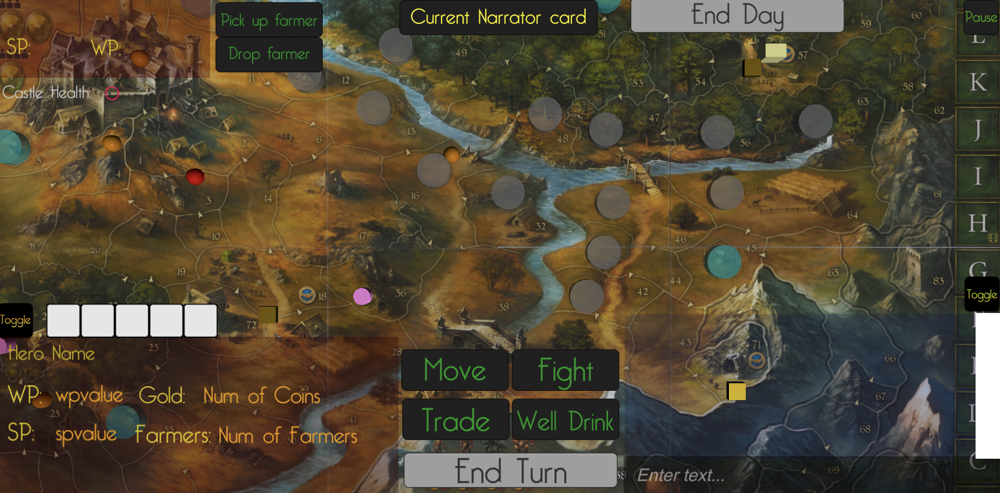

# Andor-Game
Andor is a cooperative adventure board game for 2 to 4 players designed by Michael Menzel and published by KOSMOS. In the game, a band of heroes must work together to defend a fantasy realm from invading hordes. To secure Andor’s borders, the heroes will embark on dangerous quests over the course of five unique scenarios called legends. But as the clever game system keeps creatures on the march toward the castle, the players must balance their priorities carefully.

With Unity, we implemented a multiplayer, distributed version of Andor according to the rules of the game.

